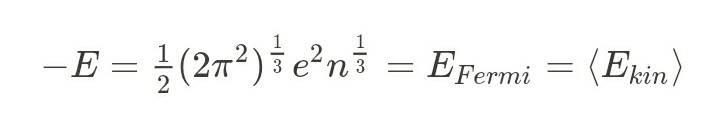

# stellar-structure
A Fortran program from Calculations of the Stellar Structure of so called "Degenerate" Stars Using an New Pressure Function.

We reconstructed the main program from 1977 of an article from the astrophysical institute at Garching. As source we had a slightly corrupted print (only the header  missed). We named it fortss.f here.

*Calculations of the stellar structure of so-called degenerate stars using a new pressure function:*

[The article](https://pure.mpg.de/pubman/faces/ViewItemOverviewPage.jsp?itemId=item_2227006)

Shortly after the discovery of these stars the author calculated them with a new pressure function, based on the virial theorem and a new zero energy:

$$-E=\tfrac {1}{ 2} (2 \pi^2)^{\frac {1}{ 3}} e^2 n^{\frac {1} {3}} = E\_{Fermi} = \langle E_{kin}\rangle$$

The program yields a maximal mass and a maximal radius for these stars, m_max at He 12 % Fe 4 % , R_max at He 3 %, Fe 1 % , see results.txt

The word *degeneracy* is due to the fact, that the Fermi-energiy is to big, a power of two to big, so that it describes systems with to much energy, that cannot be stationary. ( Many physical descriptions try to explain this, as the construction of potential holes, but in general this must not be allowed in serious physics.  )
